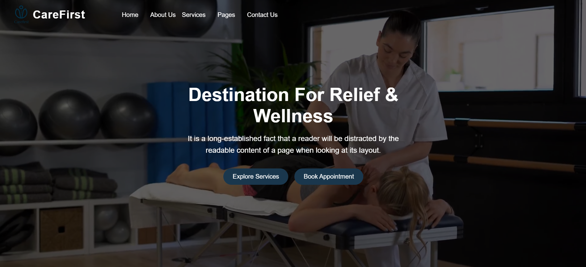
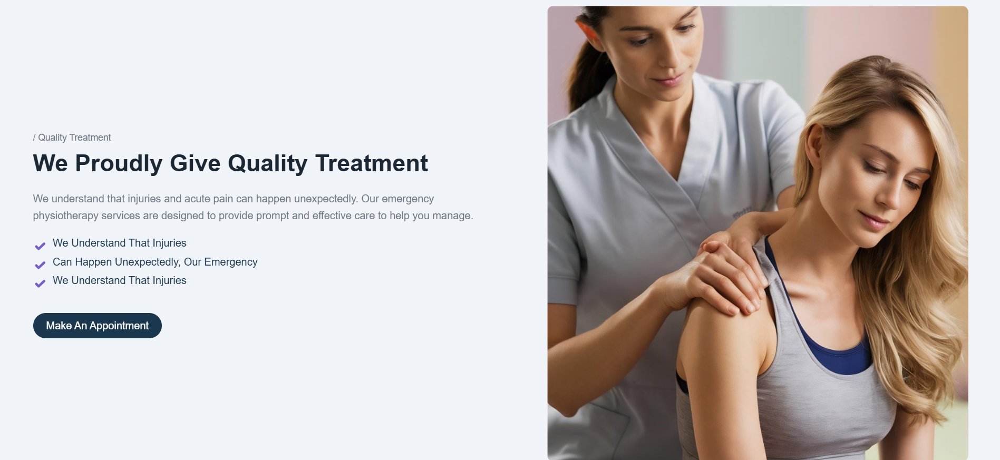

# CareFirst - Modern UI React Project 🚀  

### 🌟 A sleek, responsive, and user-friendly React.js project with a modern UI/UX design.

## 📌 Overview  
**CareFirst** is a modern, elegant, and fully responsive **React-based** project designed to deliver a smooth user experience. Built with **Tailwind CSS, React Hooks, and efficient state management**, it offers a **scalable and interactive UI** that adapts to any device.

## 🎥 Demo  
🎬 [Watch the Demo Video](Carefirst_Proj.mp4)

 

 

 

## ✨ Features  
✅ **Modern UI/UX** – Clean, responsive, and accessible design.  
✅ **Component-Based Architecture** – Reusable and maintainable React components.  

## 🛠️ Tech Stack  
- **Frontend:** React.js, Tailwind CSS / Material UI  
- **State Management:** React Hooks, Context API, Redux Toolkit  
- **Routing:** React Router DOM  
- **Backend (Optional):** Node.js, Express.js, MongoDB / Firebase  
- **Authentication:** Firebase Auth / JWT  
- **Deployment:** Vercel / Netlify / GitHub Pages  

## 📂 Installation & Setup  
To run this project locally, follow these steps:

# Clone the repository
git clone https://github.com/your-username/CareFirst.git

# Navigate to project directory
cd CareFirst

# Install dependencies
npm install

# Start the development server
npm run dev
